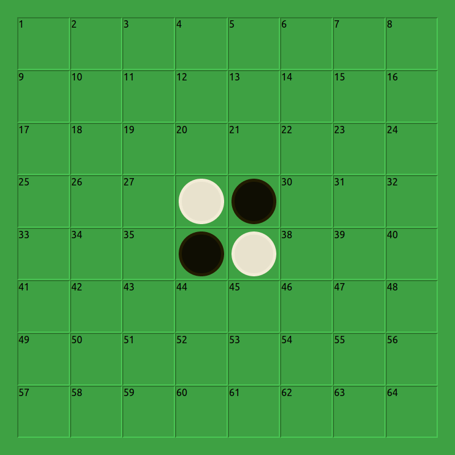

Othello react.
==============

This is just a sample project to ensure that I've learned the lessons after 
the standard tic-tac-toe react tutorial. I haven't really used react much
nor have I been doing web development, so its good to play with a few things.

Initally the scope of this will be just to create a simple project that
allows a single person to play agains themselves. I'm not intending to add
in any 2 player components at the moment but If I did then I would like to try to use something like creating a peer to peer connection. 

Okay to start with I've chosen to use typescript for this implementation. For something like this game which is well understood I think its better to create all the necessary classes for the game first. I will also be putting the grid unfilled to display early.  This isn't the final display but as I'm unsure of the best CSS properties this seems like the way to go.

## Part-1 Creating the initial board.
The initial board was created just in html just within the app component. 

Initial html looks like..
```html
<div className="game-board">
    <div className="game-square">1</div>
    <div className="game-square">2</div>
    <div className="game-square">3</div>
    ...
    ...
    <div className="game-square">27</div>
    <div className="game-square"><div className="white-piece"></div></div>
    <div className="game-square"><div className="black-piece"></div></div>
    <div className="game-square">30</div>
    ...
    ...
</div>
```

It has been layed out using a flex alignment where each item is 12.5% total width.

The pieces were created just using a border-radius of 100%

```css
.game-board {
  display: flex;
  /* height and width calculations ommited*/
  box-sizing: border-box;
  flex-wrap: wrap; /*Allows the cells to wrap correctly*/
  align-content: center; /*Removes vertical gap in flex*/
}

.game-board .game-square {
  width: 12.5%;
  height: 12.5%;
  /* borders and colours ommited*/
}

.white-piece {
  width:90%;
  height:90%;
  background-color:rgb(231, 226, 204);
  border-radius: 100%;
}

.black-piece {
  width:90%;
  height:90%;
  background-color:rgb(15, 13, 3);
  border-radius: 100%;
}
```

There are some more style rules associated with the board but the most important ones are here.

I could have specified `.piece` and `.white` and `.black` seperately and I may do this at a later point however for the moment it gives me an output that I'm pleased with its good enough for the moment. 



*Future enhancements*
* Use svg for pieces.
* Fix wierd resizing.

The version with just the html is at b67dca0

----------------


This project was bootstrapped with [Create React App](https://github.com/facebook/create-react-app).

## Available Scripts

In the project directory, you can run:

### `npm start` 

Runs the app in the development mode.<br>
Open [http://localhost:3000](http://localhost:3000) to view it in the browser.

The page will reload if you make edits.<br>
You will also see any lint errors in the console.

### `npm test` 

Launches the test runner in the interactive watch mode.<br>
See the section about [running tests](https://facebook.github.io/create-react-app/docs/running-tests) for more information.

### `npm run build` 

Builds the app for production to the `build` folder.<br>
It correctly bundles React in production mode and optimizes the build for the best performance.

The build is minified and the filenames include the hashes.<br>
Your app is ready to be deployed!

See the section about [deployment](https://facebook.github.io/create-react-app/docs/deployment) for more information.
